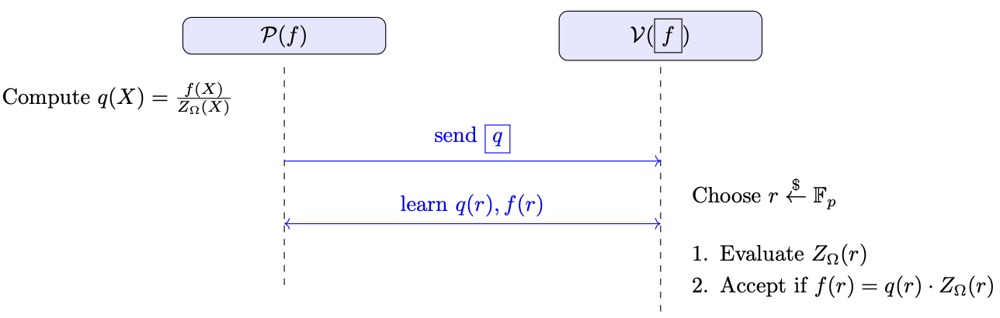

# Zero Test
In the Zero Test, a prover $\mathcal{P}$, who knows a polynomial function 
$$
f(X) \in \mathbb{F}^{(\leq d)}[X],
$$
tries to convince a verifier $\mathcal{V}$, who has oracle access $\boxed{f}$, that
$$
f(a) = 0 \quad \text{for all}\; a \in \Omega,
$$
where $\Omega = \{1,\, w,\, w^2,\, \ldots,\, w^{k-1}\}\subset \mathbb{F}_p$ is a multiplicative subgroup of size $k$.

---

## Naive Approach vs. Zero Test Protocol
1. **Naive Approach (Individual Queries)**: The verifier might query $f(a)$ for every $a\in \Omega$. This takes $\mathcal{O}(k)$ queries and verifications, which is inefficient for large $k$.  

2. **Zero Test Gadget**: The goal is to reduce the verifier’s queries to a *constant* number ($\mathcal{O}(1)$) and its verification time to $\mathcal{O}(\log k)$. The key observation is that if $f$ vanishes on all of $\Omega$,
   $$
   f(X) \;=\; q(X)\cdot Z_{\Omega}(X),
   $$
   where $Z_{\Omega}(X)$ is the vanishing polynomial of $\Omega$. This implies every element in $\Omega$ is a root of $f$.

---

## Protocol Overview

In this protocol, the prover knows the function $ f $ and the verifier has oracle access to $ f $ (in zkSNARKs, where oracles are replaced by function commitments, the verifier sends an input $ x $ to the prover, and the prover responds with $ f(x) $ along with a proof of correct evaluation).

1.  The prover computes $q(X)$ such that
   $$
   f(X) = q(X)\,Z_{\Omega}(X).
   $$
   Since $f$ vanishes on $\Omega$, $Z_{\Omega}(X)$ must divide $f(X)$. The prover then provides an oracle $\boxed{q}$ to the verifier (in zkSNARKs, a commitment to $q$).

2. The verifier picks a random challenge $r \in \mathbb{F}_p$ and sends $r$ to the prover.

3. The prover returns $f(r) \  \text{and} \  q(r),$.

4. The verifier locally computes $ Z_{\Omega}(r) $ and checks:
   $$
   f(r) \stackrel{?}{=} q(r)\,Z_{\Omega}(r).
   $$
   If the equality holds, the verifier accepts; otherwise, it rejects.

---

## Example in a Small Field

To illustrate, let’s work in the small field $\mathbb{F}_7$ and choose the subgroup
$$
\Omega = \{1,2,4\} \;\subset\;\mathbb{F}_7^\times,
$$
where $2^3 = 8 \equiv 1 \pmod{7}$. Hence, $\lvert \Omega\rvert=3$ and
$$
Z_{\Omega}(X) \;=\; X^3 -1
\quad (\text{in }\mathbb{F}_7).
$$

### Constructing $f$
We want a polynomial $f(X)$ of **degree 5** that vanishes on $\Omega$. A straightforward way is to multiply the vanishing polynomial $\bigl(X^3-1\bigr)$ by some **non-vanishing factor**. For example:
$$
f(X)\;=\;(X^3-1)\,\bigl(X^2+3\bigr)
\;\;\;\text{in}\;\mathbb{F}_7.
$$
- $\deg(f)=3+2=5$.
- $f(a)=0$ for $a\in\Omega$, because $(a^3-1)=0$ whenever $a\in\Omega$.

Concretely, if $a$ is in $\{1,2,4\}$, then $a^3\equiv1\pmod{7}$, so $(a^3-1)=0$. Hence $f(a)=0$.

#### Step 1: Prover’s Factorization

1. **Prover’s Knowledge**:
   - The prover knows $f(X)= (X^3-1)\,(X^2+3)$.
   - By inspection or standard polynomial division, the prover writes
     $$
     f(X)= q(X)\cdot Z_{\Omega}(X)
     \quad\text{where}\quad
     q(X)= X^2 + 3
     \quad\text{and}\quad
     Z_{\Omega}(X)= X^3 -1.
     $$
   - Since $\deg(f)=5$ and $\deg(Z_\Omega)=3$, we have $\deg(q)=2\le (5-3)$. Indeed, $q(X)$ is exactly $X^2+3$.

2. **Sending Oracle for $q$**:
   - The prover “publishes” or *commits* to the function $q$.  
   - In an **oracle model**, the verifier now has access to $\boxed{f}$ and $\boxed{q}$.  
   - In a **zkSNARK** setting, the prover provides a *commitment* to $q$, and the verifier can query it by specifying inputs, receiving outputs plus short proofs.

#### Step 2: Verifier’s Random Challenge

1. The verifier samples a random $r$ from $\mathbb{F}_7$ (in a larger field, from $\mathbb{F}_p$).  
2. The verifier sends this $r$ to the prover.

#### Step 3: Prover’s Response

1. **Evaluate $f$ and $q$**:  
   - Prover computes $f(r)$ and $q(r)$.  
   - In our explicit example, if $r=3$, then 
     $$
     q(3)=3^2+3=5\pmod{7}, 
     $$
     $$
     f(3)= (3^3-1)\,(3^2+3)=4\pmod{7}.
     $$

2. **Send Values (and Proofs)**:
   - The prover returns $f(r)$ and $q(r)$ to the verifier.  
   - In a SNARK setting, the prover also provides proofs that these evaluations match the committed polynomials $f$ and $q$.

#### Step 4: Verifier’s Check

1. **Compute $Z_{\Omega}(r)$**:
   - The verifier locally computes $r^3-1$. For example, if $r=3$,
     $$
     Z_{\Omega}(5)= 3^3-1=5\pmod{7}.
     $$

2. **Equality Check**:
   - The verifier checks whether 
     $$
     f(r)\;\stackrel{?}{=}\;q(r)\,\cdot\,Z_{\Omega}(r).
     $$
   - If true, the verifier *accepts*; if false, it *rejects*.

In our running example with $r=3$, the verifier would see
$$
f(3)\;\stackrel{?}{=}\;q(3)\,\cdot\bigl(3^3-1\bigr)
\;\Longrightarrow\;
4\;\stackrel{?}{=}\;(5)\,\cdot(5)\pmod{7}\;\Longrightarrow\;\text{true}.
$$
Hence, the verifier would accept (indicating $f$ likely vanishes on $\Omega$).

---

## Informal Security Proof
- **Completeness**: If $f$ vanishes on $\Omega$, then a polynomial $q(X)$ of degree $\le d-k$ exists with
  $f(X)=q(X)\,Z_{\Omega}(X).$
  For any challenge $r\in\mathbb{F}_p$, we have $f(r)=q(r)\,Z_{\Omega}(r)$. Hence the verifier’s single check passes.

- **Soundness**: A malicious prover cannot fool the verifier unless $f$ truly vanishes on $\Omega$:
   1. **Correctness of $\{f(r),q(r)\}$**:  
   We assume a secure commitment scheme prevents the prover from forging evaluation data.
   2. If $f$ does not vanish on $\Omega$, no degree-$(d-k)$ polynomial $q$ can satisfy $f(X)=q(X)\,Z_\Omega(X)$. Formally,
     $$
     f(X)= q(X)\,Z_\Omega(X) +R(X)\quad \text{with }R(X)\ne0.
     $$
     A nonzero $R(X)$ of degree $\le k$ (??) has at most $\deg(R)$ roots. A random $r$ hits $R(r)=0$ with probability $\le \deg(R)/p$, which is negligible for large $p$. Hence the verifier’s single random check catches cheating with high probability.

---

## Time and Size Complexity
Let $p$ be the field size, $d$ be the degree of $f(X)$, and $k$ be the size of $\Omega$ (also the degree of $Z_\Omega(X)$).

1. **Prover**:  
   - Computes $q(X)$ such that $f(X)=q(X)\,Z_\Omega(X)$. This requires $\mathcal{O}(k\,d)$ in the naive approach or $\mathcal{O}(d\log d)$ using Fast Fourier Transform (FFT).  
   - Commits to $q(X)$.  
   - Evaluates $f(r)$ and $q(r)$ at challenge $r$.  
   - Produces evaluation proofs in the underlying commitment scheme.

2. **Verifier**:  
   - Computes $Z_{\Omega}(r)$ in $\mathcal{O}(\log k)$ time (e.g., exponentiation by squaring to get $r^k$).  
   - Checks one evaluation proof each for $f(r)$ and $q(r)$.  
   - Performs one equality check $f(r)\stackrel{?}{=}q(r)\,Z_\Omega(r)$.  

3. **Proof Size**:  
     1. Commitment to $q(X)$.  
     2. The values $f(r)$ and $q(r)$.  
     3. Evaluation proofs for these values.  
   - All are of constant size, independent of $d$.