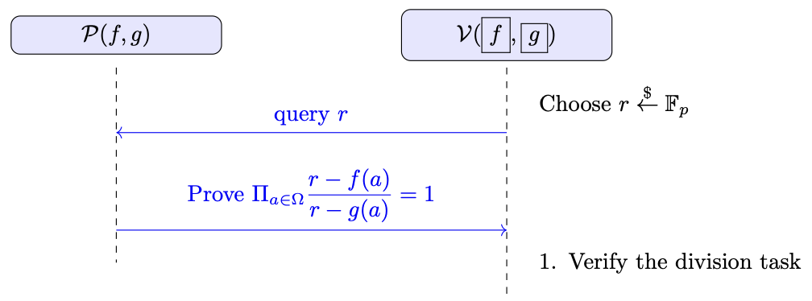

# Permutation Test
In the Permutation Test, a prover $ \mathcal{P} $, who knows two polynomial functions
$$
f(X) \in \mathbb{F}^{(\leq d)}[X] \quad \text{and} \quad g(X) \in \mathbb{F}^{(\leq d)}[X],
$$
tries to convince a verifier $ \mathcal{V} $, who holds commitments to $ f(X) $ (denoted by $\boxed{f}$) and $ g(X) $ (denoted by $\boxed{g}$), that
$$
\{ f(a) \mid a \in \Omega \} \quad \text{and} \quad \{ g(a) \mid a \in \Omega \}
$$
are permutations of each other, where $ \Omega$ is a multiplicative subgroup of $\mathbb{F}$, where$ |\Omega| = k$:
$$
\Omega = \{ 1,\, w,\, w^2,\, \ldots,\, w^{k-1} \},
$$

This task can also be considered for two sets 
$$
A = \{ a_1, a_2, \ldots, a_m \} \quad \text{and} \quad B = \{ b_1, b_2, \ldots, b_m \},
$$
instead of two functions $ f(X) $ and $ g(X) $. In this case, one can define two polynomials corresponding to the given sets. For example, for the set $A$, define $f(i) = a_i$ for $i \in [1, m]$, and similarly for $B$, define $g(i) = b_i$.

---

A naive approach for the verifier would be:

1. **Multiplying Elements**: One might propose multiplying all elements of the two sets and comparing the products. However, this is incorrect since, for example, $\{1, 3, 9, 1\}$ is not a permutation of $\{1, 3, 3, 3\}$ even though both products equal $27$.

2. **Individual Queries**: The verifier could query the oracle for each $a \in \Omega$. This requires $\mathcal{O}(k)$ queries and $\mathcal{O}(k)$ verification time, after which the verifier can check whether the two sets are permutations in $\mathcal{O}(k)$ time [1].

However, our goal is to achieve a constant number of queries (i.e., $ \mathcal{O}(1) $, independent of $ k $ and $ d $) and logarithmic verification time (i.e., $ \mathcal{O}(\log k) $).

---

## Lipton's Trick

**Lipton's Trick** is a technique used to determine whether two functions, $f$ and $g$, define permutations of each other over a set $\Omega$. That is, it checks if $\{ f(a) \mid a \in \Omega \}$ and $\{ g(a) \mid a \in \Omega \}$ are identical when order doesn’t matter.

To test this, we define two polynomials based on the outputs of $f$ and $g$:

- $f'(X) = \prod_{a \in \Omega} (X - f(a))$
- $g'(X) = \prod_{a \in \Omega} (X - g(a))$

These polynomials encode the values of $f(a)$ and $g(a)$ as their roots. Here is the key insight:

- **If $f$ and $g$ are permutations of each other**, $\{ f(a) \mid a \in \Omega \}$ and $\{ g(a) \mid a \in \Omega \}$ are equal. This means $f'(X)$ and $g'(X)$ have the same roots, so:
  \\[
  f'(X) = g'(X)
  \\]
- **If they are not permutations**, the multisets differ, and thus the polynomials have different roots, implying:
  \\[
  f'(X) \neq g'(X)
  \\]

From this, we can deduce a powerful equivalence:
\\[
f'(X) = g'(X) \quad \text{if and only if} \quad \\{ f(a) | a \in \Omega \\} \text{ and } \\{ g(a) | a \in \Omega \\} \text{ are permutations of each other.}
\\]

One might think to verify $f'(X) = g'(X)$ by picking a random point $r$ and checking if $f'(r) = g'(r)$.
However, this approach has a practical issue in zkSNARKs:

- The verifier doesn’t have direct access to $f'(X)$ or $g'(X)$.
- To compute $f'(r) = \prod_{a \in \Omega} (r - f(a))$, the verifier would need to evaluate $f(a)$ for all $a \in \Omega$, requiring $O(k)$ operations, where $k = |\Omega|$.

This inefficiency makes the naive approach impractical. We need a more efficient method, which leads us to the **Permutation Check Protocol**.
The following protocol describes a solution with logarithmic-time verification.

---

## Protocol Overview

This protocol is based on a division check. We assume that a division check protocol is already defined.

1. The verifier samples a random challenge $r \in \mathbb{F}_p$ (using a public-coin protocol) and sends $r$ to the prover.

2. The prover convinces the verifier that
$$
\prod_{a \in \Omega} \frac{f'(a)}{g'(a)} = 1,
$$
where 
$$
f'(a) = r - f(a) \quad \text{and} \quad g'(a) = r - g(a).
$$
This is done using the division check protocol. Essentially, it is a division check test, with the only difference being that the verifier holds commitments to $f$ and $g$, rather than directly to $f'$ and $g'$. However, this is not an issue because the evaluation of $f'(a)$ can be easily verified by computing $r - f(a)$.

---

## Informal Security Proof
- **Completeness**:   If the prover follows the protocol honestly and $f(X)$ and $g(X)$ are permutations of each other on $\Omega$, then the verifier will accept. This follows directly from the correctness of the division check protocol.

- **Soundness**: A malicious prover cannot fool the verifier unless the sets $\{ f(a) \mid a \in \Omega \}$ and $\{ g(a) \mid a \in \Omega \}$ are indeed permutations of each other. The main cases are:

   1. We assume the commitment scheme is secure, and there exist a secure division check protocol.
   2. **Lipton's Trick**: If the verifier is convinced that
     $$
     \prod_{a \in \Omega} \frac{r - f(a)}{r - g(a)} = 1,
     $$
     then by Lipton's trick, it follows that $\{ f(a) \mid a \in \Omega \}$ and $\{ g(a) \mid a \in \Omega \}$ are permutations of each other.
  
   3. **Permutation check does not hold**: Suppose $\{ f(a) \mid a \in \Omega \}$ and $\{ g(a) \mid a \in \Omega \}$ are not permutations of each other. Then, by Lipton's observation,
     $$
     \prod_{a \in \Omega} (X - f(a)) \neq \prod_{a \in \Omega} (X - g(a)),
     $$ where both sides are polynomials of degree $k$.

    Consequently, the polynomial
    $$
     \prod_{a \in \Omega} (X - f(a)) - \prod_{a \in \Omega} (X - g(a))
    $$ is non-zero and has a degree of at most $k$.

    When evaluated at a random value $r$, this polynomial equals 0 with a probability of at most $\frac{k}{p}$. Thus, a malicious prover can only pass the test with negligible probability.

---

## Time and Size Complexity

Let $p,\; d,\; k$ denote the field size, the degree of $f(X)$, and the size of $\Omega$ (which is also the degree of the vanishing polynomial $Z_{\Omega}(X)$), respectively.

1. **Prover**:  
   - The prover's runtime is essentially the same as that of the division check protocol.
  
2. **Verifier**:  
   - Verification is analogous to the division check protocol, achieving logarithmic-time complexity (i.e., $\mathcal{O}(\log k)$).

3. **Proof Size**:  
   - The proof size is also analogous to that of the division check protocol, remaining constant and independent of $d$.

## References
1. https://www.geeksforgeeks.org/check-if-two-arrays-are-permutations-of-each-other/