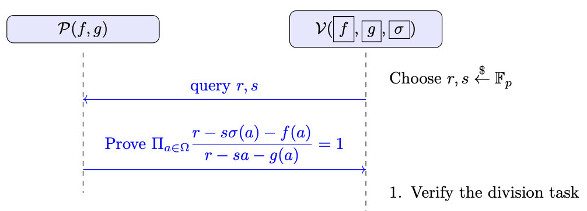

# Prescribed Permutation Test
In the Prescribed Permutation Test, a prover $ \mathcal{P} $, who knows two polynomial functions
$$
f(X) \in \mathbb{F}^{(\leq d)}[X] \quad \text{and} \quad g(X) \in \mathbb{F}^{(\leq d)}[X],
$$
and a permutation function $\sigma$ over $\Omega$,
$$
\sigma: \Omega \rightarrow \Omega,
$$
tries to convince a verifier $ \mathcal{V} $, who holds commitments to $ f(X) $ (denoted by $\boxed{f}$), $ g(X) $ (denoted by $\boxed{g}$), and $\sigma(X)$ (denoted by $\boxed{\sigma}$), that
$$
\{ f(a) = g(\sigma(a)) \mid a \in \Omega \},
$$, where $ \Omega$ is a multiplicative subgroup of $\mathbb{F}$, where$ |\Omega| = k$:
$$
\Omega = \{ 1,\, w,\, w^2,\, \ldots,\, w^{k-1} \},
$$

---

A naive approach for this task would be:
1. **Equality of $f(X) = g(\sigma(X))$**: The prover might try to use the Schwartz-Zippel lemma to prove that $f(X) = g(\sigma(X))$ by showing $f(r) = g(\sigma(r))$ for a random $r$. However, in this case the degree of $g(\sigma(X))$ is $k^2$, causing the prover's runtime to be at least quadratic in $k$. We prefer approaches that are linear or at most $\mathcal{O}(k \log k)$.
2. **Individual Queries**: The verifier could query the oracle for each $a \in \Omega$. This would require $\mathcal{O}(k)$ queries and $\mathcal{O}(k)$ verification time, after which the verifier can check whether the two sets are permutations in $\mathcal{O}(k)$ time.

However, our goal is to achieve a constant number of queries (i.e., $ \mathcal{O}(1) $, independent of $ k $ and $ d $) and logarithmic verification time (i.e., $ \mathcal{O}(\log k) $).

---

# Intuition
Consider a case where you want to prove that two sets
$$
A = \{1, 2, 5, 10\} \quad \text{and} \quad B = \{2, 5, 1, 10\}
$$
are permutations of each other. A naive approach would be to multiply all the elements of each set and check if the products are equal. However, this method fails; for instance, it would incorrectly conclude that $A = \{1, 2, 5, 10\}$ and $B = \{4, 5, 5, 1\}$ are permutations, even though they are not.

One idea is to add a random value to each element and then multiply the results. For example, pick a random $r$, and verify whether
$$
(r + 1)(r + 2)(r + 5)(r + 10) \overset{?}{=} (r + 2)(r + 5)(r + 1)(r + 10).
$$
For a random $r$ drawn from a large field, the equality will fail with high probability if the two sets are not permutations of each other.

This idea follows our approach in the Permutation Check, where we encode each set as a polynomial and then check if the two polynomials are identical. Specifically, one can define
$$
f'(X) = \prod_{a \in \Omega} (X - f(a)) = \prod_{a \in \Omega} (f(a) - X).
$$
Since our operations are over a field $\mathbb{F}$, and for a random $r$, its negation $-r$ is also uniformly random, we have
$$
f'(r) = \prod_{a \in \Omega} \bigl(f(a) + (-r)\bigr),
$$
which is analogous to the randomized encoding described above.

Now consider an indexed version of the problem. Suppose we want to prove that two sets
$$
A = \{(1, 4), (2, -1), (3, 8), (4, 0)\} \quad \text{and} \quad B = \{(1, 4), (3, 8), (2, -1), (4, 0)\}
$$
are permutations of each other. One might propose to add the two coordinates of each element, add a random $r$, and multiply the sums for each set, then compare the products. For example:
$$
(r + 1 + 4)(r + 2 + (-1))(r + 3 + 8)(r + 4 + 0) \overset{?}{=} (r + 1 + 4)(r + 3 + 8)(r + 2 + (-1))(r + 4 + 0).
$$
However, this approach fails—for instance, if $(1, 4)$ element in $B$ is altered to $(2, 3)$, the product might become 0 even though the sets are not permutations.

Thus, we need a way to uniquely encode each element $(a, b)$ into a single field element. One effective method is to use a randomized linear combination to encode $(a, b)$ as
$$
r a + b,
$$
where $r$ is a random element from $\mathbb{F}$. In this way, two distinct pairs $(a_1, b_1)$ and $(a_2, b_2)$ will be encoded to the same value only if
$$
r a_1 + b_1 = r a_2 + b_2 \quad \Longrightarrow \quad r = \frac{b_2 - b_1}{a_1 - a_2}.
$$
Since $r$ is chosen randomly from a large field, the probability of this occurring is negligible. Therefore, with high probability, this method uniquely encodes each pair.

Once the elements of sets $A$ and $B$ are encoded into single field elements, we can apply the method from the basic Permutation Test to verify whether the two sets of encoded values are permutations of each other. If they are, then the original sets $A$ and $B$ are permutations.

---

## Two Lemmas

**Lemma 1**: $f(a) = g(\sigma(a))$ for all $a \in \Omega$ if and only if the two sets 
$$
\{ (\sigma(a), f(a)) \mid a \in \Omega \} \quad \text{and} \quad \{ (a, g(a)) \mid a \in \Omega \}
$$
are permutations of each other.

*Informal Proof*: The proof is easy for both directions.

**Lemma 2**: Define the bivariate polynomials
$$
\^f(X, Y) = \prod_{a \in \Omega} (X - Y\,\sigma(a) - f(a)) \quad \text{and} \quad \^g(X, Y) = \prod_{a \in \Omega} (X - Y\,a - g(a)).
$$
Then,
$$
\^f(X, Y) = \^g(X, Y)
$$
if and only if the two sets 
$$
\{ (\sigma(a), f(a)) \mid a \in \Omega \} \quad \text{and} \quad \{ (a, g(a)) \mid a \in \Omega \}
$$
are permutations of each other.

*Informal Proof*:  
If the two sets are permutations of each other, then the factors of $\^f(X, Y)$ and $\^g(X, Y)$ match exactly, implying $\^f(X, Y) = \^g(X, Y)$. Conversely, if $\^f(X, Y) = \^g(X, Y)$, then every factor $X - Y\,\sigma(a) - f(a)$ in $\^f(X, Y)$ must correspond to a factor $X - Y\,a - g(a)$ in $\^g(X, Y)$; that is, for each $a \in \Omega$, there exists some $a' \in \Omega$ such that
$$
X - Y\,\sigma(a) - f(a) = X - Y\,a' - g(a').
$$
This implies $\sigma(a) = a'$ and $f(a) = g(a') = g(\sigma(a))$. By Lemma 1, the two sets are permutations of each other.

---

## Protocol Overview

This protocol is based on a division check. We assume that a division check protocol is already defined.

1. The verifier samples a random challenge $r, s \in \mathbb{F}_p$ (using a public-coin protocol) and sends $r, s$ to the prover.

2. The prover convinces the verifier that
$$
\prod_{a \in \Omega} \frac{f'(a)}{g'(a)} = 1,
$$
where 
$$
f'(a) = r - s\sigma(a) - f(a) \quad \text{and} \quad g'(a) = r - sa - g(a).
$$
This is done using the division check protocol. Essentially, it is a division check test, with the only difference being that the verifier holds commitments to $f$ and $g$, rather than directly to $f'$ and $g'$. However, this is not an issue because the evaluation of $f'(a), g'(a)$ can be easily verified by computing $r - s\sigma(a) - f(a)$ and $r - sa - g(a)$.

---

## Informal Security Proof
- **Completeness**:   If the prover follows the protocol honestly, then the verifier will accept. This follows directly from the correctness of the division check protocol.

- **Soundness**: A malicious prover cannot fool the verifier unless the two sets 
$$
\{ (\sigma(a), f(a)) \mid a \in \Omega \} \quad \text{and} \quad \{ (a, g(a)) \mid a \in \Omega \}
$$
are permutations of each other. The main cases are:
    1. We assume the commitment scheme is secure, and there exist a secure division check protocol.  
    2. **Permutation check does not hold**: Suppose the two sets are not permutations of each other. Then, by Lemma 2, $\^f(X, Y) \ne \^g(X, Y)$. Let $\^h(X, Y) = \^f(X, Y) - \^g(X, Y)$, and $\deg(h) \le max(\deg(f), \deg(g))$. For random $r$ and $s$, $\^h(r, s) = 0$ with probability $k/p$.
    
*In ZKP MOOC, it is written that this probability is 2d/p, which I do not understand why !!!*
---

## Time and Size Complexity

Let $p,\; d,\; k$ denote the field size, the degree of $f(X)$ and $g(X)$, and the size of $\sigma(X)$ and $\Omega$ (which is also the degree of the vanishing polynomial $Z_{\Omega}(X)$), respectively.

1. **Prover**:  
   - The prover's runtime is essentially the same as that of the division check protocol, with an additional evaluation and proof of evaluation for $\sigma(wr)$. This is important because the verifier holds commitments to $f$, $g$, and $\sigma$, and needs the value of $\sigma(wr)$ to verify the correctness of the product check.

2. **Verifier**:  
   - Verification is analogous to the division check protocol, achieving logarithmic-time complexity (i.e., $\mathcal{O}(\log k)$). In addition, the verifier must perform one extra verification for the value of $\sigma(wr)$ and use it in checking the overall equality.

3. **Proof Size**:  
   - The proof size is also analogous to that of the division check protocol, remaining constant and independent of $d$. The proof additionally includes the value $\sigma(wr)$ and its corresponding commitment proof.

## References
1. https://www.geeksforgeeks.org/check-if-two-arrays-are-permutations-of-each-other/