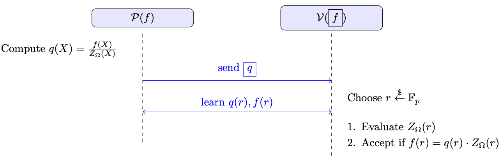

# Zero Test

Zero test is a task where a prover $\mathcal{P}$, knowing a polynomial function $f(X) \in \mathbb{F}^{(\leq d)}[X]$, tries to convince a verifier $\mathcal{V}$, who holds a commitment $\text{com}_f$ to $f$, that
$$
f(a) = 0 \quad \text{for all} \; a \in \Omega,
$$

where $\Omega$ is a subset of $\mathbb{F}_p$ (i.e., $\Omega \subseteq \mathbb{F}_p$), and $|\Omega| = k$.

---

A naive try by the verifier would be:
1. **Individual proofs**: The verifier queries the prover for a proof that $f(a) = 0$ for each $a \in \Omega$. This produces $\mathcal{O}(k)$ proofs, plus $\mathcal{O}(k)$ commitment verification operation.

Our goal is to design a protocol where the prover can convince the verifier that $f(a) = 0$ for all $a \in \Omega$, with the proof size being *constant* in the underlying commitment proof size (instead of $\mathcal{O}(k)$), and the verification time being *logarithmic* in $k$ (instead of $\mathcal{O}(k)$).

The key observation is:

$$
\text{If } f(a) = 0 \;\text{for all}\; a \in \Omega, 
\quad \text{then} \quad 
f(X) = q(X)\,\cdot Z_{\Omega}(X),
$$
where $Z_{\Omega}(X)$ is the vanishing polynomial over $\Omega$. 

---

Finally, we need to specify $\Omega$. In the following protocol, the verifier must compute $Z_{\Omega}(X)$ locally and quickly (i.e., in $\log k$ time). To achieve this, we define

$$
\Omega = \{1, w, w^2, \ldots, w^{k-1}\} \;\subset\; \mathbb{F}_p,
$$
where $w$ is a primitive $k$th root of unity (i.e., $w^k = 1$).  
In this setting, the vanishing polynomial is
$$
Z_{\Omega}(X) = X^k - 1,
$$
and the verifier can compute $X^k - 1$ in $\mathcal{O}(\log k)$ time (e.g., by repeated squaring).

---

### Protocol Overview

1. The prover computes the polynomial $q(X)$ such that 
   $f(X) = q(X)\,Z_{\Omega}(X).$
   Since $f$ is zero on $\Omega$, $Z_{\Omega}$ divides $f$ and such a $q$ exists.
   The prover sends a *commitment* to $q$ (denoted $\text{com}_q$) to the verifier.

2.    The verifier samples a random challenge $r \in \mathbb{F}_p$ (a public-coin protocol) and sends $r$ to the prover.

3. The prover returns
   $f(r), q(r),$
   along with proofs $\pi_{f, r, f(r)}$ and $\pi_{q, r, q(r)}$ showing these openings are consistent with the committed polynomials $f$ and $q$. This ensures the prover cannot lie about the polynomial values.

4. The verifier locally computes $Z_{\Omega}(r)$. It then checks
   $$
   f(r) \stackrel{?}{=} q(r)\cdot Z_{\Omega}(r).
   $$
   If this holds, the verifier accepts; otherwise, it rejects.

### Informal Security Proof
- **Completeness**: If the prover follows the protocol honestly and $f(X)$ truly vanishes on $\Omega$, then there is a valid $q(X)$ of degree at most $\deg(f) - \deg(Z) = d - k$ such that $f(X) = q(X)\,Z_{\Omega}(X)$ for all $X$. Hence, for any challenge $r$, $f(r) = q(r)\,Z_{\Omega}(r),$ and the verifier accepts.

- **Soundness**: We show that a malicious prover cannot fool the verifier into accepting unless $f(X)$ actually vanishes on $\Omega$. The main cases are:
   1. **Secure Commitment Scheme**: We assume the commitment scheme is secure, so a malicious prover cannot cheat when revealing $f(r)$ or $q(r)$ in Step 3.
   2. **Incorrect $q$**: Suppose $f(X)$ is divisible by $Z_{\Omega}(X)$, but the prover sends some incorrect $q'(X)$ in Step 1. If the verifier’s checks pass, it implies a valid factorization 
   $$
   f(X) = q'(X)\,Z_{\Omega}(X),
   $$
   so $Z_{\Omega}(X)$ does indeed divide $f(X)$. Thus $f(X)$ is zero on $\Omega$, no matter what the correct quitionet is, whether $q$ or $q'$.
   3. **$f(X)$ Not Zero on $\Omega$**: Suppose $f(X)$ does *not* vanish on $\Omega$. Then there is no polynomial $q(X)$ of degree at most $d - k$ for which 
      $$
      f(X) = q(X)\,Z_{\Omega}(X).
      $$
      In other words, we can write
      $$
      f(X) \;=\; q(X)\,Z_{\Omega}(X) \;+\; R(X),
      $$
      where $R(X)$ is a nonzero remainder polynomial. A nonzero polynomial of degree $\deg(R)$ over $\mathbb{F}_p$ has at most $\deg(R)$ roots. Hence, if the verifier picks a random $r \in \mathbb{F}_p$, the probability that 
      $$
      R(r) = 0 \quad \text{(i.e. } f(r) = q(r)\,Z_{\Omega}(r)\text{)}
      $$
      is at most $\deg(R)/|\mathbb{F}_p|$. Therefore, except with negligible probability, the verifier’s check 
      $$
      f(r) \stackrel{?}{=} q(r)\,Z_{\Omega}(r)
      $$
      will fail, and the verifier will reject.

      Since $\deg(R) \le \deg(q) \le d-k$, the protocol is sound, assuming $(d-k)/p$ is negligible.

## Time and Size Complexity
Let $|\mathbb{F}_p|, d, k$ denote the field size, the degree of $f(X)$, and the size of $\Omega$ (respectively the degree of the vanishing polynomial $Z_\Omega(X)$).

1. **Prover**:  
   - The prover must compute $q(X)$ such that $f(X) = q(X) Z_\Omega(X)$. This can be done in 
     $\mathcal{O}(k\,d)$ via naive polynomial multiplication/division or in 
     $\mathcal{O}(d \log d)$ using the Fast Fourier Transform (FFT).  
   - Additionally, the prover needs to:
     - Commit to $q(X)$.
     - Evaluate both $f(r)$ and $q(r)$ at the random challenge $r$.
     - Generate correct evaluation proofs for $f(r)$ and $q(r)$ in the commitment scheme.

2. **Verifier**:  
   - The verifier computes the vanishing polynomial $Z_\Omega(X)$ in 
     $\mathcal{O}(\log k)$ time (e.g., via exponentiation by squaring for $X^k - 1$).  
   - The verifier checks:
     1. The correctness of the committed evaluations ($\pi_{f,r, f(r)}$ and $\pi_{q, r, q(r)}$) — this cost depends on the underlying commitment scheme.
     2. One equality check $f(r) \stackrel{?}{=} q(r)\,Z_\Omega(r)$.  
   - In the KZG commitment scheme, both the proof verification and equality check take constant time, independent of $d$ or $|\mathbb{F}_p|$.

3. **Proof Size**:  
   - The proof consists of:
     1. A commitment to $q(X)$.
     2. The values $f(r)$ and $q(r)$ and the evaluation proofs showing these values match the committed polynomials.  
   - In KZG, all of these elements are of constant size, yielding a proof size that does not grow with $d$