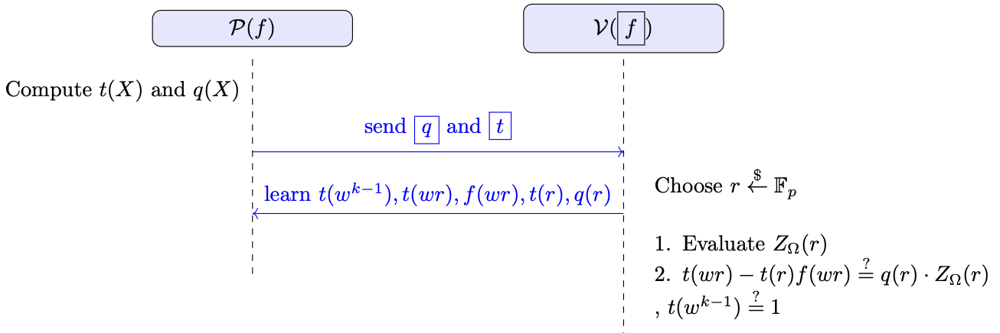

# Product Test

Product test is a task where a prover $\mathcal{P}$, knowing a polynomial function $f(X) \in \mathbb{F}^{(\leq d)}[X]$, tries to convince a verifier $\mathcal{V}$, who holds a commitment $\text{com}_f$ to $f$, that
$$
\prod_{a \in \Omega} f(a) = 1,
$$
where $\Omega \subseteq \mathbb{F}_p$ and $|\Omega| = k$.

---
A naive verifier strategy might be:

1. **Individual proofs**: The verifier queries the prover for $f(a)$ for each $a \in \Omega$. This results in $\mathcal{O}(k)$ proof openings and $\mathcal{O}(k)$ verification operations. Finally, the verifier multiplies all values to check if their product is $1$.

Our goal is to design a protocol where the prover can convince the verifier of
$$
\prod_{a \in \Omega} f(a) = 1
$$
using a *constant-size* proof (independent of $k $ aside from the baseline commitment scheme costs) and a *logarithmic* verifier runtime (rather than $\mathcal{O}(k) $).

We use the same set $\Omega$ from the zero test, i.e.,
$$
\Omega = \{1, w, w^2, \dots, w^{k-1}\},
$$

where $w$ is a primitive $k$th root of unity in $\mathbb{F}_p$.

---

## Auxiliary Polynomial $t(X)$

We define a polynomial $t(X)$ such that

$$
t(w \cdot x) = f(w \cdot x) \, t(x) \quad \forall x \in \Omega.
$$

To understand this relationship, let us expand it over the points of $\Omega$:

- For $x = w^{k-1}$:  
  $$
  t(w^k) = f(w^k)\, t(w^{k-1})
  \quad\Longrightarrow\quad
  t(1) = f(1)\, t(w^{k-1}),
  $$
  since $w^k = 1$.

- For $x = w^{k-2}$:
  $$
  t(w^{k-1}) = f(w^{k-1})\, t(w^{k-2}).
  $$

- For $x = w^{k-3}$:
  $$
  t(w^{k-2}) = f(w^{k-2})\, t(w^{k-3})
  \quad\Longrightarrow\quad
  t(w^{k-1}) = f(w^{k-1})\, f(w^{k-2})\, t(w^{k-3}),
  $$

and so on, until eventually:

- For $x = w$:
  $$
  t(w^2) = f(w^2)\, t(w),
  $$
- For $x = 1$:
  $$
  t(w) = f(w)\, t(1).
  $$

Chaining these together, we get:

$$
t(w^{k-1}) 
= 
f(w^{k-1})\, f(w^{k-2}) \,\dots\, f(w)\, f(1)\, t(w^{k-1}).
$$

If $t(w^{k-1}) \neq 0$ (i.e. $t(w^{k-1}) = 1$), we can divide both sides by $t(w^{k-1})$ and obtain

$$
1
=
f(w^{k-1})\, f(w^{k-2})\, \dots \, f(w)\, f(1).
$$

Thus, to show this relationship, the prover’s goal boils down to proving:

1. $t(w^{k-1}) = 1$.  
2. $t(w \cdot x) = f(w \cdot x)\, t(x)$ for all $x \in \Omega$.

---

### Protocol Overview

1. The prover computes
    - polynomial $t(X)$ of degree $k-1$ such that
    $$
    t(wX) = t(X)\, f(wX) \quad \forall\, X \in \Omega.
    $$
    $t(X)$ can be computed using $k$ points in $\Omega$ and knowing the fact that:
    $$
    t(w^{k-1}) = 1, \quad t(1) = f(1), \quad t(w^2) = t(w)\,f(w^2), \quad \dots
    $$

    - polynomial $q(X)$ of degree $d - 1$ such that
    $$
    q(X) \;=\; \frac{\,t(wX) \;-\; t(X)\,f(wX)\,}{Z_{\Omega}(X)},
    $$
    where $Z_{\Omega}(X)$ is the vanishing polynomial over $\Omega$. Since 
    $$
    t(wX) - t(X)\,f(wX) = 0 \quad \forall\, X \in \Omega,
    $$
    such a $q(X)$ exists.
    The prover sends a *commitment* to $q$ and $t$ (denoted $\text{com}_q$, $\text{com}_t$) to the verifier.

2. The verifier samples a random challenge $r \in \mathbb{F}_p$ (a public-coin protocol) and sends $r$ to the prover.

3. The prover returns:
   $$
   t(w^{k-1}),\quad t(wr),\quad t(r),\quad q(r),\quad f(wr)
   $$
   along with their commitment proofs (showing these openings are consistent with the committed polynomials $t(X)$ and $q(X)$). This ensures the prover cannot lie about the polynomial values.

4. The verifier locally computes $Z_{\Omega}(r)$. It then checks:
   $$
   t(w^{k-1}) \stackrel{?}{=} 1
   \quad\text{and}\quad
   t(wr) - t(r)\,f(wr) \stackrel{?}{=} q(r)\,Z_{\Omega}(r).
   $$
   If both checks hold, the verifier accepts; otherwise, it rejects.

### Informal Security Proof
- **Completeness**: If the prover follows the protocol honestly and $t(wX) - t(X)\,f(wX)$
  truly vanishes on $\Omega$, then there is a valid $q(X)$ of degree at most 
  $(\deg(t) + \deg(f) - \deg(Z_{\Omega})) = (k-1) + d - k = d - 1,$  
  such that
  $$
  t(wX) - t(X)\,f(wX) \;=\; q(X)\,Z_{\Omega}(X) 
  \quad\forall\,X.
  $$
  Therefore, for any challenge $r$,
  $$
  t(wr) - t(r)\,f(wr) \;=\; q(r)\,\bigl(Z_{\Omega}(r)\bigr),
  $$
  and the verifier’s checks succeed.

- **Soundness**:A malicious prover cannot fool the verifier unless 
  $$
  t(wX) - t(X)\,f(wX) = 0 \quad \forall\,X \in \Omega
  \quad\text{and}\quad
  t(w^{k-1}) = 1.
  $$
  The main cases are:
   1. **Secure Commitment Scheme**: We assume the commitment scheme is secure, so a malicious prover cannot cheat when revealing $f(wr),\,t(r),\,t(wr),\,t(w^{k-1}),\,q(r)$ in Step 3.
   2. **Incorrect $q(X)$ or $t(X)$**: Suppose the product check really holds and the prover sends malicious polynomials $t'(X)$ or $q'(X)$. If the verifier’s checks pass for a random challenge $r$,
     $$
     t'(wr) - t'(r)\,f(wr) 
     = 
     q'(r)\,Z_{\Omega}(r),
     $$
     it implies 
     $$
     t'(wX) - t'(X)\,f(wX) 
     =
     q'(X)\,Z_{\Omega}(X)
     \quad\Longrightarrow\quad
     t'(wX) = t'(X)\,f(wX),
     $$
     holding for all $X \in \Omega$. Thus the relationship is indeed satisfied.
   3. **Product check does not hold**: Suppose $\prod_{a \in \Omega} f(a) \;\neq\; 1.$
     Then $t(wX) - t(X)\,f(wX)$ does *not* vanish on $\Omega$ (i.e., no polynomial $q(X)$ of degree $\le d - 1$ can factor out $Z_{\Omega}(X)$ from this difference). Formally, we could write
     $$
     t(wX) - t(X)\,f(wX) 
     =
     q(X)\,Z_{\Omega}(X) \;+\; R(X),
     $$
     where $R(X)$ is a nonzero remainder polynomial. Since a nonzero polynomial of degree $\deg(R)$ over $\mathbb{F}_p$ has at most $\deg(R)$ roots, picking a random $r \in \mathbb{F}_p$ means
     $$
     \Pr\bigl(R(r) = 0\bigr) 
     \;\le\; 
     \frac{\deg(R)}{\lvert\mathbb{F}_p\rvert}.
     $$
     Hence, except with negligible probability, the verifier’s check 
     $$
     t(wr) - t(r)\,f(wr) \;\stackrel{?}{=}\; q(r)\,\bigl(Z_{\Omega}(r)\bigr)
     $$
     fails, and the verifier rejects.

	 Since $\deg(R) \le \deg(q) \le d - 1$, the protocol is sound, assuming $(d - 1)/p$ is negligible.

## Time and Size Complexity
Let $|\mathbb{F}_p|,\; d,\; k$ denote the field size, the degree of $f(X)$, and the size of $\Omega$ (respectively the degree of the vanishing polynomial $Z_{\Omega}(X)$).

1. **Prover**:  
   - The prover computes $t(X)$ (degree $k-1$) and $q(X)$ (degree $d-1$). This can be done in 
     $\mathcal{O}(d \log d)$ time (e.g., via FFT-based methods).  
   - The prover then:
     1. Commits to $t(X)$ and $q(X)$.
     2. Evaluates 
        $$
        q(r),\quad t(r),\quad t(wr),\quad f(wr),\quad t(w^{k-1})
        $$
        at the random challenge $r$.
     3. Generates evaluation proofs that these values match the committed polynomials.

2. **Verifier**:  
   - Computes $Z_{\Omega}(r)$ in 
     $\mathcal{O}(\log k)$ time (e.g., by exponentiation for $(r^k - 1)$).  
   - Checks:
     1. The correctness of the commitments and their openings (depends on the underlying commitment scheme).
     2. The equality $t(w^{k-1}) \stackrel{?}{=} 1$.
     3. The equality 
        $$
        t(wr) - t(r)\,f(wr) 
        \;\stackrel{?}{=}\; 
        q(r)\,\bigl(Z_{\Omega}(r)\bigr).
        $$

   In the KZG commitment scheme, these checks are constant time.

3. . **Proof Size**:  
   - The proof contains:
     1. Commitments to $q(X)$ and $t(X)$.
     2. The values 
        $$q(r),\; t(r),\; t(wr),\; f(wr),\; t(w^{k-1}),$$ 
        plus the corresponding evaluation proofs.  
   - In a KZG scheme, all of these are of constant size, independent of $d$ or $k$.