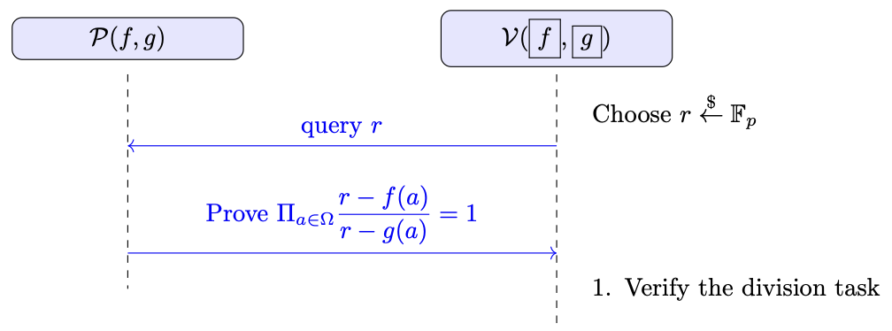

# Permutation Test

Permutation test is a task where a prover $\mathcal{P}$, knowing two functions $f(X)$ and $g(X)$, tries to convince a verifier $\mathcal{V}$, who holds commitments to $f(X)$, $\text{com}_f$, and $g(X)$, $\text{com}_g$, that
$$
\{f(a) | a \in \Omega\} and \{g(a) | a \in \Omega\}
$$ are permutations of each other,
where $\Omega \subseteq \mathbb{F}_p$ and $|\Omega| = k$.

This task can be considered for two sets $A = \{a_1, a_2, \ldots, a_m\}$ and $B = \{b_1, b_2, \ldots, b_m\}$, instead of two functions $f(X)$ and $g(X)$.

In this case, it is not hard to define two polynomials $f(X)$ and $g(X)$ for the given sets $A$ and $B$. For example, for the set $A$, we define $f(i) = a_i for i \in [1, m]$, and similarly $g(X)$ for $B$. THe degree of $A$ and $B$ is $k-1$.

---
A naive verifier strategy might be:

1. **Multiplying ELements**: One may propose to multiply all elements of two sets, and check if they equal. This is incorrect as $\{1, 3, 9, 1\}$ is not a permutation of $\{1, 3, 3, 3\}$, even though the multiplication result is 27.

2. **Permutation Check**: The verifier queries the prover for $f(a)$ and $g(a)$ for each $a \in \Omega$. This results in $\mathcal{O}(2k)$ proof openings and $\mathcal{O}(2k)$ verification operations. Finally, the verifier can check whether two sets are permutation or no in $\mathcal{O}(k)$ [1].

Our goal is to design a protocol where the prover can convince the verifier
using a *constant-size* proof (independent of $k $ aside from the baseline commitment scheme costs) and a *logarithmic* verifier runtime (rather than $\mathcal{O}(k) $).

We use the same set $\Omega$ from the zero test, i.e.,
$$
\Omega = \{1, w, w^2, \dots, w^{k-1}\},
$$

where $w$ is a primitive $k$th root of unity in $\mathbb{F}_p$.

---

## Lipton's Trick
If two sets $\{f(a) | a \in \Omega\} and \{g(a) | a \in \Omega\}$ are permutations of each other
one can define $f'(X) = \Pi_{a\in \Omega} (X - f(a))$ and $g'(X) = \Pi_{a\in \Omega} (X - g(a))$.
If $f(X)$ and $g(X)$ are permutations of each other on the set $\Omega$, it is easy to see that 
$f'(X) = g'(X)$. On the other hand, if they are not permutation of each other, $f'(X) \ne g'(X)$, and this one is not hard to see as well. 
From logic, we know $\not A \implies \not B$, then, $B \implies A$. THerefore, if they are not permutation of each other, $f'(X) \ne g'(X)$, implies if $f'(X) = g'(X)$, they are permutation of each other.  
Having these together, $f'(X), g'(X)$ are equal if and only iff $\{f(a) | a \in \Omega\} and \{g(a) | a \in \Omega\}$ are permutations of each other.

Another incorrect observation based on this trick would be:
1. Prover convinces the verifier that $f'(X) = g'(X)$, by evaluating them in a random point $r$, based on SZDL lemma. The observation is correct, but the verifier does not know whether $f'(X) = \Pi_{a\in \Omega} (X - f(a))$ or no. To do that, verifier needs to know the evaluation of $f'(r)$, and then doing $k$ evalauaitons to verify $f'(r) = \Pi_{a\in \Omega} (r - f(a))$, which is more than $log k$ complexity we expect from the verifier. 

The comming protocol describes a solution with logarithmic time verifier.

---
### Protocol Overview

This protocol is based on division check. Therefore, we assume one knows division check protocol completely.

1. The verifier samples a random challenge $r \in \mathbb{F}_p$ (a public-coin protocol) and sends $r$ to the prover.

2. The prover convince the verifier that 
$$
\Pi_{a\in \Omega} f'(a)/g'(a) = 1
$$, where $f'(a) = r - f(a)$ and $g'(a) = r - g(a)$.
THis can be done based on the division check. In fact, it is basically a division check test, 
with the only difference that verifier has commitments to $f$ and $g$, instead of $f', g'$. 
However, this is not a concern, as the evalaution of $f'(a)$ can be verified easily by using $r - f(a)$.

### Informal Security Proof
- **Completeness**: If the prover follows the protocol honestly and $f(X), g(X)$
  are permutations on $\Omega$, verifiers would accept, and this is easy to show.

- **Soundness**:A malicious prover cannot fool the verifier. The main cases are:
   1. **Secure Commitment Scheme**: We assume the commitment scheme is secure, and there exist a secure division check protocol.
   2. **Lipton's Trick**: If verifier is convinced that $\Pi_{a\in \Omega} (X - f(a))/(X - g(a)) = 1$, according to the Lipton's trick this indicates that I mentioned, this shows that these two are permutations of each other.
   3. **Permutation check does not hold**: Suppose $\{f(a) | a \in \Omega\} and \{g(a) | a \in \Omega\}$ are not permutations of each other. According to the lipton's lemma, $$\Pi_{a\in \Omega} (X - f(a)) \ne \Pi_{a\in \Omega} (X - g(a))$$, and therefore, for a random $r$, $$\Pi_{a\in \Omega} (r - f(a)) = \Pi_{a\in \Omega} (r - g(a))$$ happens with probability of $d/p$, where $d$ is the degree of function $f$ or $g$, and $p$ is the filed size.
   Therefore, for a negligible $d/p$, a malicious prover passes the test with only a negligible probability.

<!-- ## Time and Size Complexity
Let $|\mathbb{F}_p|,\; d,\; k$ denote the field size, the degree of $f(X)$, and the size of $\Omega$ (respectively the degree of the vanishing polynomial $Z_{\Omega}(X)$).

1. **Prover**:  
   - The prover computes $t(X)$ (degree $k-1$) and $q(X)$ (degree $d-1$). This can be done in 
     $\mathcal{O}(d \log d)$ time (e.g., via FFT-based methods).  
   - The prover then:
     1. Commits to $t(X)$ and $q(X)$.
     2. Evaluates 
        $$
        q(r),\quad t(r),\quad t(wr),\quad f(wr),\quad t(w^{k-1})
        $$
        at the random challenge $r$.
     3. Generates evaluation proofs that these values match the committed polynomials.

2. **Verifier**:  
   - Computes $Z_{\Omega}(r)$ in 
     $\mathcal{O}(\log k)$ time (e.g., by exponentiation for $(r^k - 1)$).  
   - Checks:
     1. The correctness of the commitments and their openings (depends on the underlying commitment scheme).
     2. The equality $t(w^{k-1}) \stackrel{?}{=} 1$.
     3. The equality 
        $$
        t(wr) - t(r)\,f(wr) 
        \;\stackrel{?}{=}\; 
        q(r)\,\bigl(Z_{\Omega}(r)\bigr).
        $$

   In the KZG commitment scheme, these checks are constant time.

3. . **Proof Size**:  
   - The proof contains:
     1. Commitments to $q(X)$ and $t(X)$.
     2. The values 
        $$q(r),\; t(r),\; t(wr),\; f(wr),\; t(w^{k-1}),$$ 
        plus the corresponding evaluation proofs.  
   - In a KZG scheme, all of these are of constant size, independent of $d$ or $k$. -->

## References
1. https://www.geeksforgeeks.org/check-if-two-arrays-are-permutations-of-each-other/